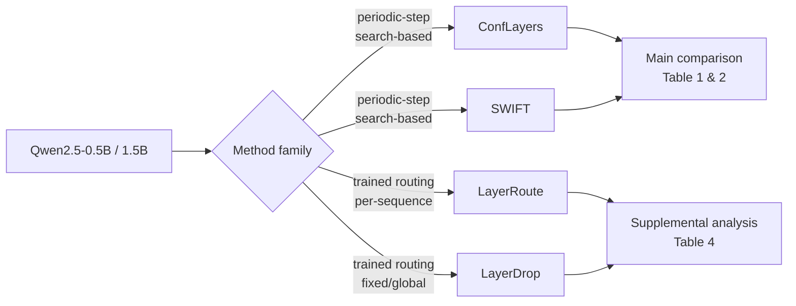
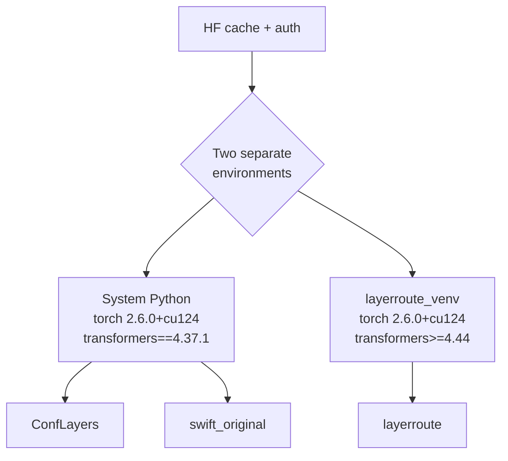
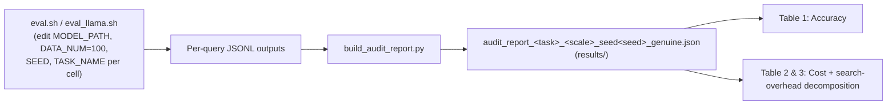
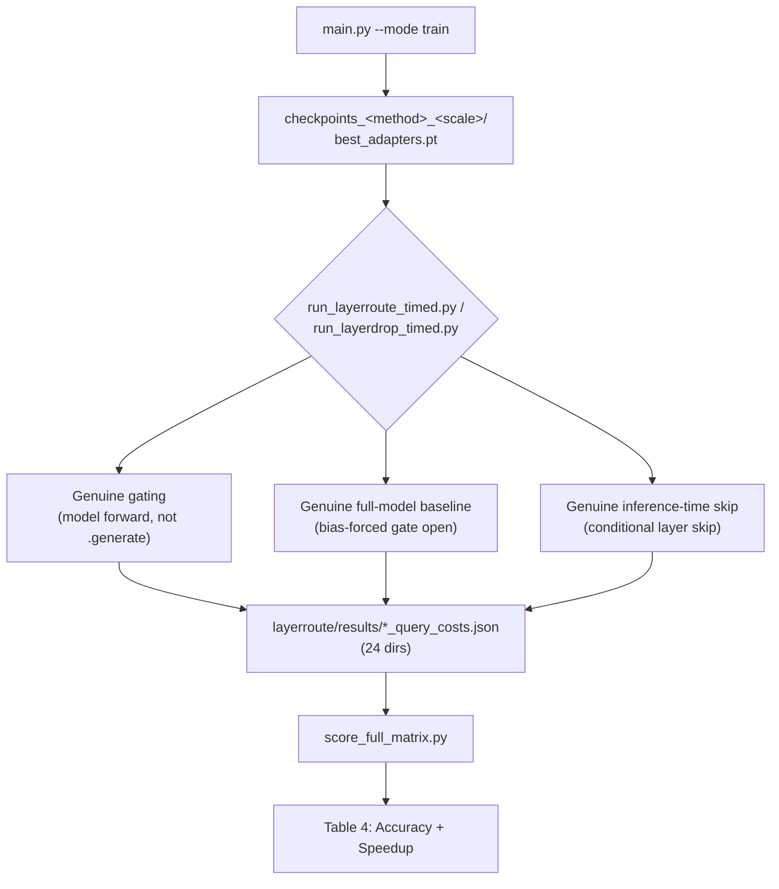
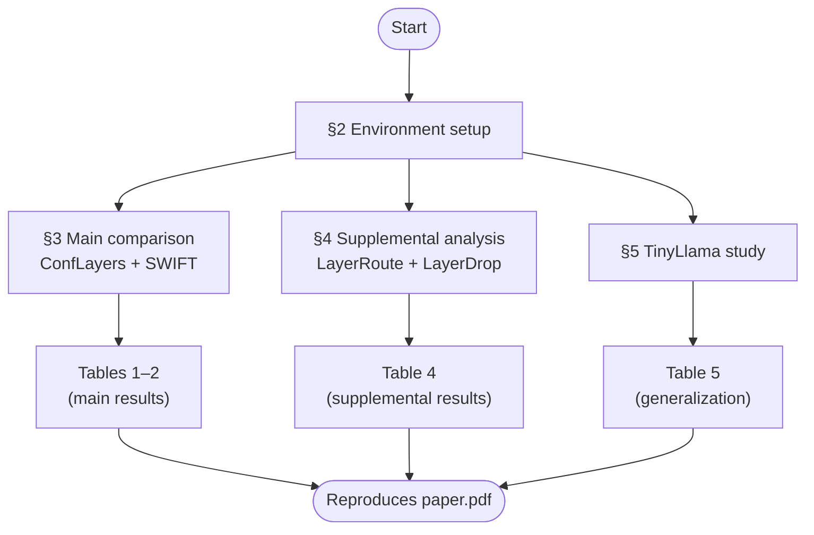

# Audit_LayerSkip

Reproduction guide for **"A Rigor-Matched Audit of Periodic-Step Layer Skipping for Efficient LLM Inference: ConfLayers versus SWIFT, with a Supplemental Analysis of Trained Routing Alternatives"** (`paper.pdf`).

This repo audits two families of layer-skipping methods for efficient LLM inference:

- **Main comparison** — ConfLayers and SWIFT, two *periodic-step, search-based* methods, against vanilla decoding.
- **Supplemental analysis** — LayerRoute and LayerDrop, two *trained-routing* methods at a coarser decision granularity, reported separately rather than head-to-head (see Section 2 of the paper for why).



---

## 1. Repository structure

```
Audit_LayerSkip/
├── ConfLayers/                  # Reference implementation + our eval driver
│   ├── evaluation/
│   │   ├── inference_conflayer.py
│   │   └── inference_baseline.py
│   ├── model/conflayers/
│   └── eval.sh                  # Template invocation (edit before running, see §3)
├── swift_original/              # Reference implementation, ported to Qwen2
│   ├── evaluation_llama/
│   │   ├── inference_swift.py
│   │   └── inference_baseline.py
│   ├── model/swift/
│   │   └── modeling_qwen2.py    # Our from-scratch Qwen2 port
│   └── eval_llama.sh            # Template invocation (edit before running, see §3)
├── layerroute/                  # LayerRoute + LayerDrop: training & evaluation
│   ├── models/
│   │   ├── gated_qwen.py        # LayerRoute (Qwen2.5)
│   │   ├── gated_llama.py       # LayerRoute (TinyLlama, §6)
│   │   ├── layerdrop_qwen.py    # LayerDrop
│   │   ├── router.py
│   │   └── lora.py
│   ├── utils/{config.py, trainer.py}
│   ├── data/loader.py
│   ├── main.py                  # Training entry point
│   ├── run_layerroute_timed.py  # LayerRoute cost + accuracy measurement
│   ├── run_layerdrop_timed.py   # LayerDrop cost + accuracy measurement
│   ├── evaluate.py              # Teacher-forced eval (skip-differential, perplexity)
│   ├── score_full_matrix.py     # Scores the full supplemental matrix
│   ├── checkpoints*/            # Trained LoRA adapters + logs (6 dirs, see §4)
│   └── results/                 # 24 measured result dirs (see §4)
├── audit_harness/harness/       # Search-overhead decomposition (frozen-replay)
├── results/                     # 12 "genuine" audit reports — main comparison (§3)
├── stage3_results/
│   ├── STAGE3_NOTES.txt         # Running project notes / experiment log
│   └── tinyllama_layerroute/    # TinyLlama generalization results (§6)
├── build_audit_report.py        # Combines a scale/task/seed's raw outputs into one report
├── multi_seed_sweep.sh
└── cnndm_sweep.sh
```

---

## 2. Environment setup

Three separate environments are required — ConfLayers and SWIFT's reference implementations pin an older `transformers`, while LayerRoute/LayerDrop need a newer one.



```bash
# HF cache (avoids re-downloading weights across runs)
export HF_HOME=/workspace/.cache/huggingface
export TRANSFORMERS_CACHE=/workspace/.cache/huggingface
mkdir -p $HF_HOME
pip install -U huggingface_hub
hf auth login

# --- ConfLayers + swift_original (system Python) ---
cd ConfLayers
pip3 install torch==2.6.0 torchvision==0.21.0 --index-url https://download.pytorch.org/whl/cu124
pip3 install -r requirements_pip.txt
pip3 install torch==2.6.0 torchvision==0.21.0 --index-url https://download.pytorch.org/whl/cu124 --force-reinstall --no-deps
pip install "huggingface_hub<1.0,>=0.19.3" --force-reinstall
chmod +x eval.sh
cd ../swift_original && chmod +x eval_llama.sh

python3 -c "import torch, bayes_opt, fastchat, transformers, datasets, rouge_score; \
print(torch.__version__, torch.cuda.is_available(), transformers.__version__)"
# expect: 2.6.0+cu124 True 4.37.1

# --- layerroute (separate venv) ---
cd ..
python3 -m venv layerroute_venv
source layerroute_venv/bin/activate
pip install torch==2.6.0 torchvision==0.21.0 --index-url https://download.pytorch.org/whl/cu124
pip install "transformers>=4.44" accelerate peft datasets sentencepiece rouge-score
deactivate
```

> **Dataset note:** CNN/DailyMail's canonical HuggingFace ID is `abisee/cnn_dailymail`, not the bare `cnn_dailymail` — the code in this repo already uses the correct namespaced ID.

---

## 3. Reproducing the main comparison — ConfLayers & SWIFT

This is the audit's primary result (paper §6–6.2.1): a 2 task × 2 scale × 3 seed matrix, for Vanilla, ConfLayers, and SWIFT.



**Step 1 — run each method for one (task, scale, seed) cell.** Edit `eval.sh` / `eval_llama.sh` (or pass flags directly) for each combination:

```bash
# ConfLayers — from ConfLayers/
python -m evaluation.inference_conflayer \
  --model-path Qwen/Qwen2.5-0.5B-Instruct --model-id qwen2.5-0.5b \
  --temperature 0.0 --top-p 0.85 --dtype bfloat16 \
  --task-name gsm8k --data-num 100 --max-new-tokens 512 --seed 2024 \
  --context-window 100 --search-interval 30 --max-opt-iter 100 \
  --max-score 0.95 --skip-ratio 0.4 --optimization conflayers
```

```bash
# SWIFT — from swift_original/ (--model-family qwen2 required; defaults to llama)
python -m evaluation_llama.inference_baseline \
  --model-path Qwen/Qwen2.5-0.5B-Instruct --model-id qwen2.5-0.5b \
  --max-new-tokens 512 --task-name gsm8k --data-num 100 \
  --temperature 0.0 --top-p 0.85 --seed 2024 --dtype bfloat16

python -m evaluation_llama.inference_swift \
  --model-path Qwen/Qwen2.5-0.5B-Instruct --model-id qwen2.5-0.5b --model-family qwen2 \
  --temperature 0.0 --top-p 0.85 --dtype bfloat16 \
  --task-name gsm8k --data-num 100 --max-new-tokens 512 --seed 2024 \
  --context-window 50 --opt-interval 1 --bayes-interval 25 --max-opt-iter 1000 \
  --max-tolerance-iter 300 --max-score 0.93 --optimization --bayes
```

Repeat for `--task-name {gsm8k, cnndm}` × `--model-path {Qwen/Qwen2.5-0.5B-Instruct, Qwen/Qwen2.5-1.5B-Instruct}` × `--seed {2024, 42, 123}` — **12 cells total**.

**Step 2 — combine into an audit report per cell.** `build_audit_report.py` merges ConfLayers, SWIFT, and LayerRoute's per-query cost files into one report (LayerRoute's file is also required — its CNN/DM gold summaries are reused to avoid a redundant dataset load, per the script's own docstring); the paper's Table 1/2 uses only the Vanilla/ConfLayers/SWIFT numbers from it:

```bash
python build_audit_report.py \
  --conflayers_json ConfLayers/outputs/gsm8k/gsm8k_100/model_answer/qwen2.5-0.5b/<conflayers_result>.jsonl \
  --swift_json swift_original/outputs/gsm8k/gsm8k_100/model_answer/qwen2.5-0.5b/<swift_result>.jsonl \
  --layerroute_json layerroute/results/layerroute_timed_gsm8k_05b_seed2024_SKIPFIX/layerroute_query_costs.json \
  --vanilla_json ConfLayers/outputs/gsm8k/gsm8k_100/model_answer/qwen2.5-0.5b/<vanilla_result>.jsonl \
  --model_id Qwen2.5-0.5B --seed 2024 --task gsm8k \
  --out results/audit_report_gsm8k_05b_seed2024_genuine.json
```

The 12 pre-computed reports are already in `results/` — Step 1–2 reproduce them from scratch. Each report's `methods` dict includes LayerRoute alongside ConfLayers/SWIFT (a byproduct of the shared script); only the latter two feed the paper's main-comparison tables.

**Step 3 — search-overhead decomposition is already in the Step 2 output.** `build_audit_report.py` computes each method's `search_overhead_fraction` automatically (via `audit_harness/harness/timing_split.py`'s frozen-replay logic) and prints a gate check when it runs:

```bash
python3 -c "
import json
d = json.load(open('results/audit_report_gsm8k_05b_seed2024_genuine.json'))
for name, m in d['methods'].items():
    print(name, m.get('search_overhead_fraction'))
"
```

### Expected results (Table 1 & 2 in the paper)

| Task | Scale | Vanilla | ConfLayers | SWIFT |
|---|---|---|---|---|
| GSM8K | 0.5B | 0.180 | 0.147 | **0.303** |
| GSM8K | 1.5B | **0.413** | 0.077 | 0.307 |
| CNN/DM | 0.5B | 0.169 | 0.178 | **0.190** |
| CNN/DM | 1.5B | 0.204 | 0.215 | **0.219** |

---

## 4. Reproducing the supplemental analysis — LayerRoute & LayerDrop



**Step 1 — train** (0.5B and 1.5B, both methods; checkpoints already included in `layerroute/checkpoints*`, retrain to reproduce from scratch):

```bash
cd layerroute && source ../layerroute_venv/bin/activate

python main.py --mode train --method layerroute --model_family qwen --model_scale 0.5b \
  --max_steps 3000 --output_dir ./checkpoints_0.5B_backup

python main.py --mode train --method layerroute --model_family qwen --model_scale 1.5b \
  --max_steps 3000 --output_dir ./checkpoints

python main.py --mode train --method layerdrop --model_family qwen --model_scale 0.5b \
  --max_steps 3000 --output_dir ./checkpoints_layerdrop_05b

python main.py --mode train --method layerdrop --model_family qwen --model_scale 1.5b \
  --max_steps 3000 --output_dir ./checkpoints_layerdrop_15b
```

**Step 2 — measure accuracy + cost** for all 2 tasks × 2 scales × 3 seeds (24 cells total, per method):

```bash
python run_layerroute_timed.py \
  --ckpt checkpoints_0.5B_backup/best_adapters.pt \
  --model_scale 0.5b --dataset gsm8k --n_eval 100 --seed 2024 \
  --train_wall_clock_seconds 382 \
  --out_dir results/layerroute_timed_gsm8k_05b_seed2024_SKIPFIX
```

Repeat across `--dataset {gsm8k, cnndm}` × `--model_scale {0.5b, 1.5b}` × `--seed {2024, 42, 123}`, swapping `--ckpt` and the script (`run_layerdrop_timed.py`) for LayerDrop.

> **Note on the measurement protocol** (paper §7.2): both scripts verify, not assume, three properties — the gated forward pass genuinely differs from an ungated one; the baseline genuinely forces every layer open (not just an unused flag); and inference genuinely skips closed-gate layers rather than computing and discarding them. If you modify these scripts, re-verify all three before trusting new numbers.

**Step 3 — score the full matrix:**

```bash
python score_full_matrix.py
```

### Expected results (Table 4 in the paper)

| Task | Scale | LayerRoute acc. | LayerRoute speedup | LayerDrop acc. | LayerDrop speedup |
|---|---|---|---|---|---|
| GSM8K | 0.5B | 0.137 | 1.08× | 0.010 | 1.30× |
| GSM8K | 1.5B | 0.003 | 1.32× | 0.060 | 1.25× |
| CNN/DM | 0.5B | 0.102 | 1.33× | 0.091 | 1.29× |
| CNN/DM | 1.5B | 0.150 | 1.09× | 0.134 | 1.25× |

---

## 5. Reproducing the TinyLlama generalization study (§8)

Tests whether LayerRoute's skip-differential (learned gate skips more on tool-call than planning steps) transfers to a different architecture.

```bash
cd layerroute
python main.py --mode train --method layerroute --model_family llama \
  --max_steps 3000 --output_dir ./checkpoints_llama

python evaluate.py --model_family llama --ckpt checkpoints_llama/best_adapters.pt \
  --n_eval 100 --out_dir checkpoints_llama/paper_results
```

> **Gotcha:** several scripts in this repo (including `evaluate.py`) mutate a shared `QWEN_SPEC` dict in-place rather than taking an explicit `--model_scale` flag; its on-disk default may be left at whichever scale a previous run last set. `evaluate.py --model_family llama` uses `LLAMA_SPEC` instead, so this doesn't affect the TinyLlama study specifically — but if you see a `size mismatch` error when loading a Qwen checkpoint, check `utils/config.py`'s `QWEN_SPEC` default first.

Results land in `stage3_results/tinyllama_layerroute/paper_results/` — expect the differential to invert in sign relative to Qwen2.5 (paper Table 5).

---

## 6. End-to-end pipeline



---

## Citation

```bibtex
@inproceedings{anonymous2027auditlayerskip,
  title={A Rigor-Matched Audit of Periodic-Step Layer Skipping for Efficient LLM Inference: ConfLayers versus SWIFT, with a Supplemental Analysis of Trained Routing Alternatives},
  author={Sikdar, Prateek Kumar and Anant, Atul and Ghosh, Arpan},
  year={2027}
}
```
